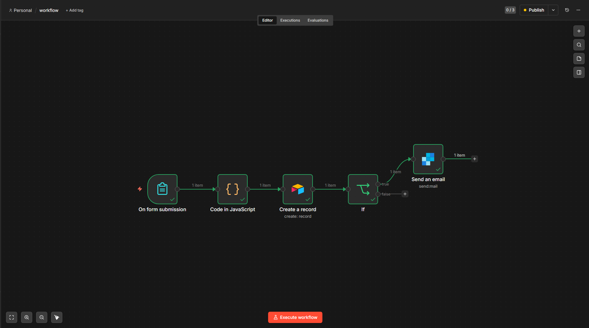

# 🎫 Sistema de Classificação Automática de Tickets com IA

Automação inteligente de suporte ao cliente que classifica tickets, roteia para equipes e envia notificações multicanal em tempo real.

> Projeto de portfólio — construído com n8n + Groq (LLaMA 3.3) +
> Airtable + SendGrid + Telegram



---

## ✨ O que o sistema faz

- Recebe tickets via formulário web
- Classifica automaticamente por **categoria**, **prioridade** e **sentimento**
- Gera número de ticket único (TKT-XXXXXX)
- Define **SLA automático** por prioridade
- Separa tickets **críticos** dos normais com tratamento diferenciado
- Roteia para a equipe correta via Switch de 5 outputs
- Envia **email personalizado** por categoria (SendGrid)
- Envia **alerta em tempo real** no Telegram por canal dedicado
- Salva tudo no Airtable com dashboard de métricas

---

## 🗂️ Classificação automática

| Campo      | Opções                                    |
|------------|-------------------------------------------|
| Categoria  | Bug, Dúvida, Financeiro, Acesso, Outro    |
| Prioridade | Baixa, Média, Alta, Crítica               |
| Sentimento | Neutro, Frustrado, Satisfeito, Urgente    |
| SLA        | 1h (Crítica), 4h (Alta), 24h (Média), 72h (Baixa) |

---

## 🛠️ Stack

| Ferramenta     | Função                                 |
|----------------|----------------------------------------|
| n8n            | Orquestração do fluxo                  |
| Groq API       | Classificação por IA (LLaMA 3.3 — grátis) |
| Airtable       | Banco de dados + dashboard             |
| SendGrid       | Notificações por email                 |
| Telegram Bot   | Alertas em tempo real por canal        |
| JavaScript     | Integração HTTP com a Groq API         |

---

## 🚀 Versões

### v1.0 — Base
- Formulário de abertura de tickets
- Classificação automática por IA
- Armazenamento no Airtable

### v1.2 — Roteamento inteligente
- SLA automático por prioridade
- IF separando críticos dos normais
- Switch com 5 outputs por categoria
- Notificação por email via SendGrid
- Dashboard no Airtable

### v2.0 — Notificações em tempo real
- Integração com Telegram Bot
- Canal exclusivo para tickets críticos
- Canal por categoria para tickets normais
- Resolvido perda de dados entre nós com `$('Switch').item.json`

---

## ▶️ Como rodar localmente

1. Clone o repositório
2. Instale o n8n: `npm install -g n8n`
3. Inicie com módulos habilitados:

```powershell
$env:NODE_FUNCTION_ALLOW_BUILTIN="https,http"; npx n8n
```

4. Importe o `workflow.json` no n8n
5. Configure as credenciais:

| Credencial       | Onde obter                        |
|------------------|-----------------------------------|
| Groq API Key     | console.groq.com (gratuito)       |
| Airtable Token   | airtable.com/create/tokens        |
| SendGrid API Key | app.sendgrid.com                  |
| Telegram Token   | @BotFather no Telegram            |

6. Ative o workflow e acesse a URL do formulário

---

## 🗺️ Melhorias Planejadas

- [x] Classificação automática por IA
- [x] Roteamento por categoria e prioridade
- [x] Notificações por email (SendGrid)
- [x] Alertas Telegram em tempo real
- [ ] Relatório semanal automático
- [ ] Bot interativo de consulta de tickets
